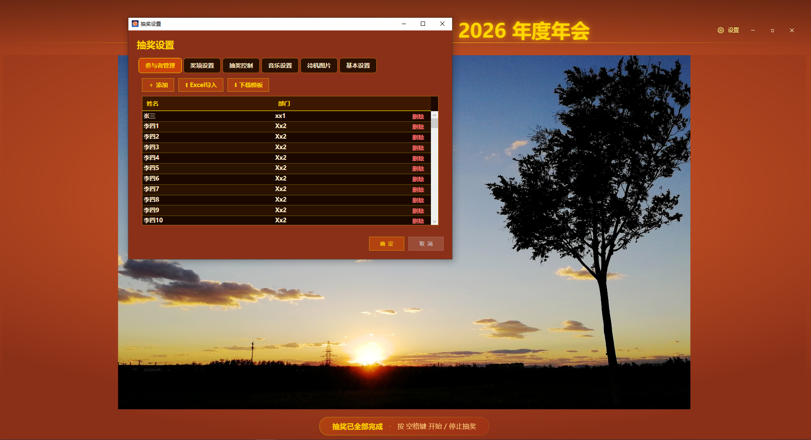

# Raffe · 年会抽奖

一款面向企业年会、团建活动的桌面抽奖应用，基于 WPF 开发，支持参与者管理、多奖项设置、背景音乐、待机图片轮播等完整功能。



## 功能特性

### 抽奖核心
- **旋转名字抽奖**：名字在屏幕中央旋转滚动，按空格键开始/停止
- **多奖项支持**：自定义奖项级别、总人数、每批人数
- **倒计时**：抽奖前可显示倒计时增强氛围
- **中奖展示**：获奖名单醒目展示，支持抽奖汇总结果页

### 参与者管理
- 手动添加参与者（姓名、部门）
- **Excel 批量导入**：支持从 Excel 导入参与者名单
- 下载导入模板
- 单条删除

### 奖项设置
- 从低到高排序的奖项级别
- 自定义级别名称、总人数、批次数

### 音乐设置
- 默认背景音乐
- 抽奖旋转音乐
- 中奖庆祝音乐
- 音量调节  
- 支持 MP3 / WAV / WMA / AAC 格式

### 待机图片
- 空闲时居中轮播待机图片
- 可自定义切换间隔
- 支持 JPG / PNG / BMP / GIF

### 基本设置
- 界面主题切换
- 公司名称、年份配置（用于标题展示）

## 技术栈

- **.NET 6** + **WPF**（Windows 桌面应用）
- **CommunityToolkit.Mvvm**：MVVM 框架
- **ClosedXML**：Excel 导入/导出

## 环境要求

- Windows 10/11
- .NET 6.0 或更高

## 快速开始

```bash
# 克隆项目
git clone <repository-url>
cd Raffe

# 编译运行
dotnet build
dotnet run
```

## 项目结构

```
Raffe/
├── MainWindow.xaml        # 主窗口（抽奖界面、结果汇总）
├── Views/
│   └── SettingsWindow.xaml # 抽奖设置弹窗
├── ViewModels/            # MVVM 视图模型
├── Controls/              # 自定义控件（旋转抽奖、待机轮播等）
├── Models/                # 数据模型
├── Services/              # 业务服务（如 Excel 导入）
└── Assets/                # 图标等资源
```

## 操作说明

1. 点击右上角 **⚙ 设置** 打开抽奖设置
2. 在 **参与者管理** 中导入或添加参与者
3. 在 **奖项设置** 中配置各奖项
4. 关闭设置后，按 **空格键** 开始/停止抽奖

## 许可证

本软件开源，可自由使用、修改和分发，**禁止用于商业用途**。


## 效果
